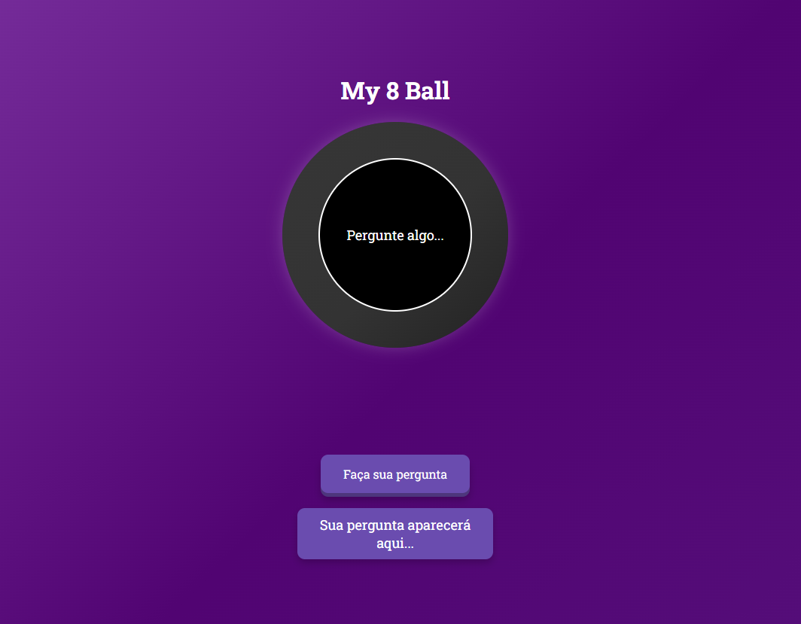

# 🎱 Voice 8 Ball

An interactive "Magic 8 Ball" project that answers voice questions in real-time. Available in **English** and **Portuguese**.


---

## 🚀 Features

- **Voice Recognition:** Ask questions using your voice, and the 8 Ball will respond.
- **Random Answers:** Fun and unpredictable answers in two languages (English and Portuguese).
- **Speech Synthesis:** The 8 Ball "speaks" the answer to you.
- **Intuitive Interface:** Modern and responsive design with smooth animations.
- **Multi-language:** Easily switch between English and Portuguese.

---

## 🛠️ How to Use

### Prerequisites

- Modern browser (recommended: Google Chrome).
- Access to a microphone.

### Steps to Run

1. **Clone the repository:**
   ```bash
   git clone https://github.com/PedroAlbelo/voice-8ball.git

    Made by Pedro Albelo.
    Contact: albelo.pedrogit@gmail.com

